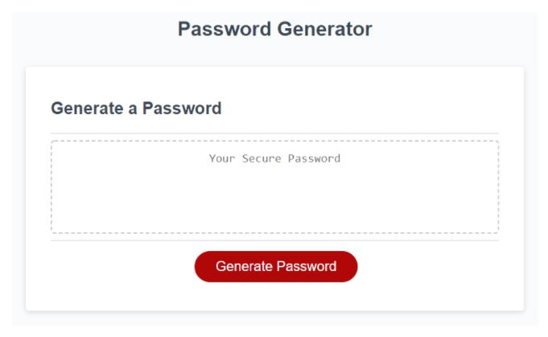

# Password Generator

## Description

In this project I created a password generator that creates a password based on the user's criteria. The user is presented with a series of prompts and gets to select which criteria to include in the password. They have a choice of including lowercase, uppercase, numeric and/or special characters. When all prompts are answered and validated then a password is generated and displayed on the page.

[Website Link](https://trrgomez.github.io/password-generator/)